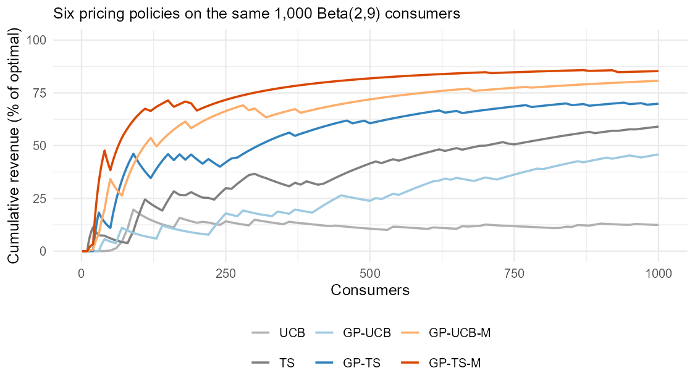

# PricingBandits

Multi-armed bandit approaches to pricing experiments with an unknown demand
curve, from:

> Weaver, I. N., Kumar, V., & Jain, L. *Nonparametric Pricing Bandits Leveraging
> Informational Externalities to Learn the Demand Curve*. Marketing Science.

This package contains the streamlined, core bandit machinery. The full
replication code for the paper (WTP construction, expected-reward analysis,
figures) lives in the separate replication repository; results from this
package are validated seed-for-seed bit-identical against it.

> Looking for the **Python version**? See
> [pricingbandits-py](https://github.com/ian-weaver/pricingbandits-py).

[](https://CRAN.R-project.org/package=PricingBandits)

## Installation

```r
# from CRAN (released version):
install.packages("PricingBandits")

# or the development version from GitHub:
# install.packages("devtools")
devtools::install_github("ian-weaver/PricingBandits")
```

## Quick start

You supply one consumer valuation (willingness to pay) per round — drawn from
*any* distribution you like — plus a set of candidate prices. The chosen policy
prices each arriving consumer and learns from buy/no-buy feedback alone.

```r
library(PricingBandits)

set.seed(1)
valuations <- rbeta(2500, 2, 9)          # any WTP process you like

out <- PricingBandit(valuations,
                     prices     = seq(10)/10,
                     policy     = "GP-TS-M",
                     batch_size = 10)

table(out$PricesTested)
attr(out, "diagnostics")
```

## Policies

| Name | Description |
|------|-------------|
| `"UCB"` | Upper Confidence Bound on independent arms |
| `"TS"` | Thompson Sampling with Beta posteriors per arm |
| `"GP-UCB"`, `"GP-TS"` | Gaussian-process variants — arms correlated through a GP demand curve (first informational externality) |
| `"GP-UCB-M"`, `"GP-TS-M"` | Monotonic variants — demand draws weakly decreasing everywhere by construction, via basis-function reconstruction from derivative-constrained draws (second informational externality) |

Options: `hetero = TRUE` enables the heterogeneous-noise extension for GP
variants; `reset = n` wipes the history every `n` consumers (time-varying
demand); `num_knots` controls the monotonic variants' constraint grid and
defaults to 11 **regardless of the number of arms** — with many more knots the
truncated sampler operates in a near-degenerate high-dimensional space and can
break down, so keep it modest even for dense price grids. `timeout` (default
5 seconds) bounds each truncated-sampling attempt before the fallback chain
advances; raise it on slow machines, lower it to fail over to cheaper
approximations sooner.

## Policy Comparison Example

Running each policy with one seed on the same 1,000 consumers — willingness
to pay drawn from a Beta(2, 9) distribution — gives the results below. To
compare policies, score each price the bandit posted by its expected revenue
under the true distribution, and track the cumulative total as a percentage
of what always charging the optimal price would have earned:

```r
expected_revenue <- prices * (1 - pbeta(prices, 2, 9))   # true revenue at each posted price
grid             <- seq(1e-6, 1, 1e-6)
optimal          <- max(grid * (1 - pbeta(grid, 2, 9)))  # best any price could do
earned           <- expected_revenue[match(out$PricesTested, prices)]
pct_of_optimal   <- cumsum(earned) / (seq_along(earned) * optimal) * 100
```

<picture>
  <source media="(prefers-color-scheme: dark)" srcset="man/figures/README-comparison-dark.png">
  
</picture>

See the [package vignette](https://CRAN.R-project.org/package=PricingBandits)
for the full walk-through this figure comes from, including the
heterogeneous-noise variants and every argument explained.

## Diagnostics

Every run counts the numerical fallback paths (hyperparameter-optimization
failures, truncated-sampler timeouts, last-resort samplers); in normal
operation these are all zero. See `GetDiagnostics()`.
